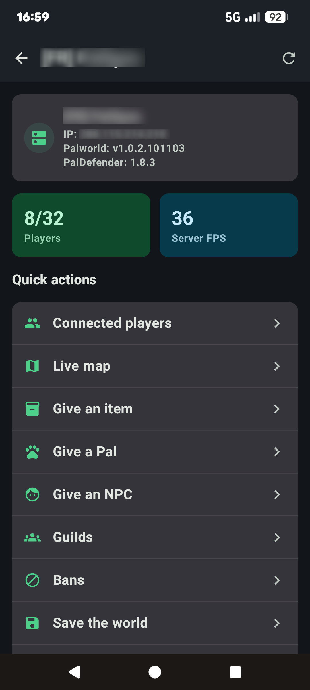
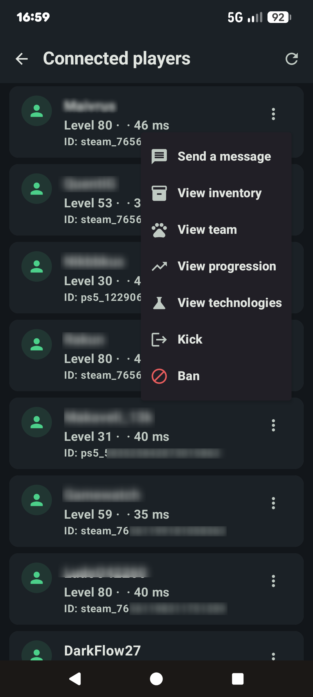
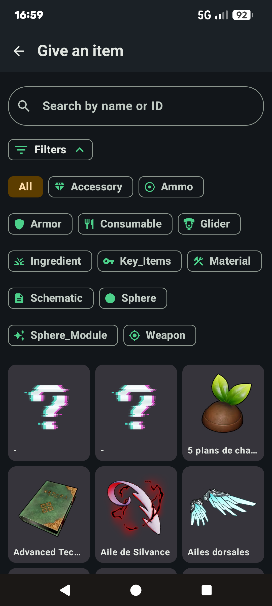
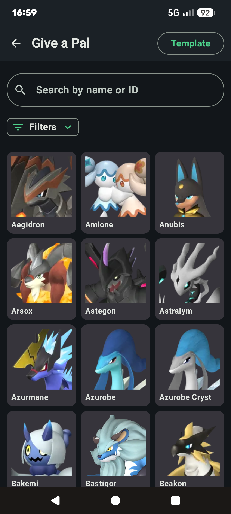
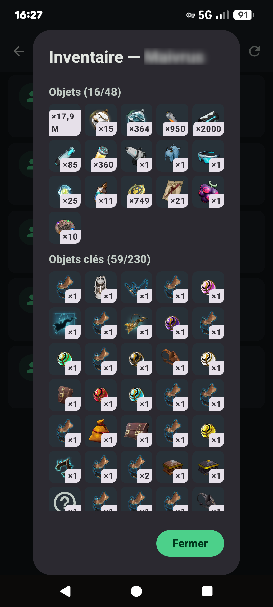
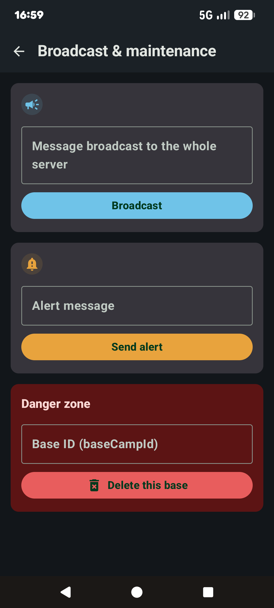
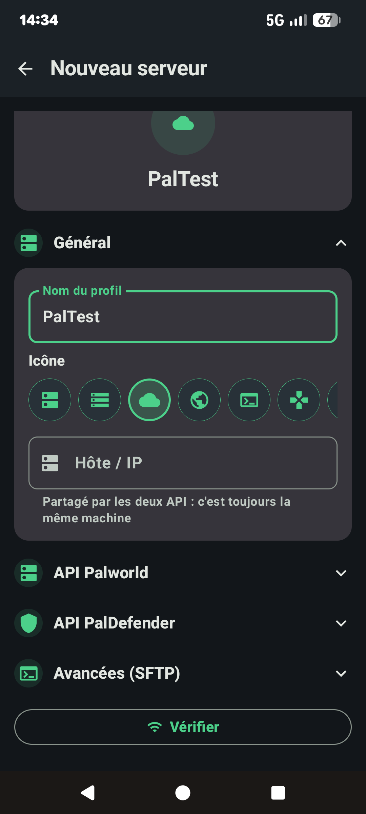

# PalManager

*[Read in English](README.md)*

Application Android d'administration pour serveurs dédiés **Palworld**, pilotée via l'API REST
officielle Palworld et l'API REST du mod **[PalDefender](https://github.com/UltimeIT/PalDefender)**.

> Projet non-officiel, sans lien avec Pocketpair. Les données de jeu (noms/images d'objets et de
> Pals) proviennent de [paldb.cc](https://paldb.cc) et restent la propriété de leurs ayants droit —
> voir [Licence](#licence).

## Aperçu

<table>
<tr>
<td align="center"><b>Dashboard</b><br></td>
<td align="center"><b>Joueurs connectés</b><br></td>
<td align="center"><b>Donner un item</b><br></td>
</tr>
<tr>
<td align="center"><b>Donner un Pal</b><br></td>
<td align="center"><b>Inventaire d'un joueur</b><br></td>
<td align="center"><b>Diffusion & maintenance</b><br></td>
</tr>
<tr>
<td align="center"><b>Ajout d'un serveur</b><br></td>
</tr>
</table>

## Fonctionnalités

- **Dashboard** : infos serveur, joueurs en ligne, FPS, versions Palworld/PalDefender, sauvegarde,
  redémarrage/arrêt.
- **Joueurs connectés** : liste en temps réel, kick/ban, message privé, inventaire/équipe/
  progression/technologies détaillés par joueur.
- **Give item / Give Pal** : recherche par nom ou image dans un catalogue embarqué (items, Pals,
  PNJ, technologies), filtres par catégorie/élément/rareté/métier.
- **Carte en direct** : position des joueurs sur la carte des Îles Palpagos.
- **Guildes** et **bannissements** (joueurs + IP).
- **Diffusion & maintenance** : broadcast, alertes, messages, zone danger (reload config,
  suppression de base).
- Thème clair/sombre, interface FR/EN.

## Stack technique

Kotlin + Jetpack Compose (Material 3), MVVM, Hilt, Room, Retrofit/OkHttp + kotlinx.serialization,
Coil, Jetpack Navigation Compose, DataStore Preferences.

## Prérequis serveur

- Un serveur Palworld avec l'[API REST officielle](https://docs.palworldgame.com/) activée
  (`RESTAPIEnabled=True` dans `PalWorldSettings.ini`).
- Le mod **[PalDefender](https://github.com/UltimeIT/PalDefender)** installé et son API REST
  activée, pour les fonctionnalités que l'API officielle ne couvre pas (give item/Pal, techs,
  guildes, bans IP...).

## Build

```bash
./gradlew assembleDebug
```

L'APK debug est généré dans `app/build/outputs/apk/debug/`.

### Tests visuels (Paparazzi)

Le projet embarque [Paparazzi](https://github.com/cashapp/paparazzi) pour rendre les composables
Compose sur JVM sans émulateur (utile en dev pour vérifier rapidement un écran) :

```bash
./gradlew :app:recordPaparazziDebug
```

### Régénérer le dataset items/Pals

`tools/scrape_paldb.py` scrape paldb.cc/fr pour produire `app/src/main/assets/data/*.json` +
les images associées (catalogue embarqué, chargé une fois au premier lancement dans une base
Room avec recherche FTS).

## Licence

Le code de ce dépôt est publié sous licence [MIT](LICENSE).

Les données de jeu embarquées dans `app/src/main/assets/data/` et `app/src/main/assets/images/`
(noms, statistiques, images d'objets/Pals/technologies) sont extraites de paldb.cc et restent la
propriété de leurs ayants droit respectifs (Pocketpair). Elles ne sont pas couvertes par la
licence MIT et sont incluses ici à titre d'usage non commercial, pour le fonctionnement de l'outil.
