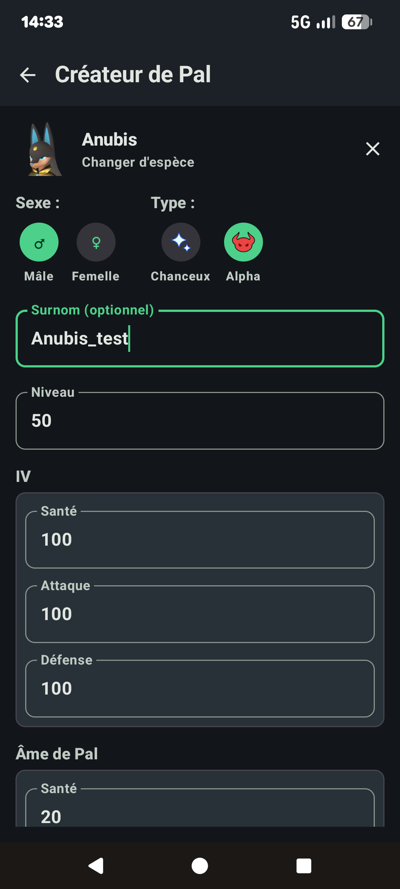
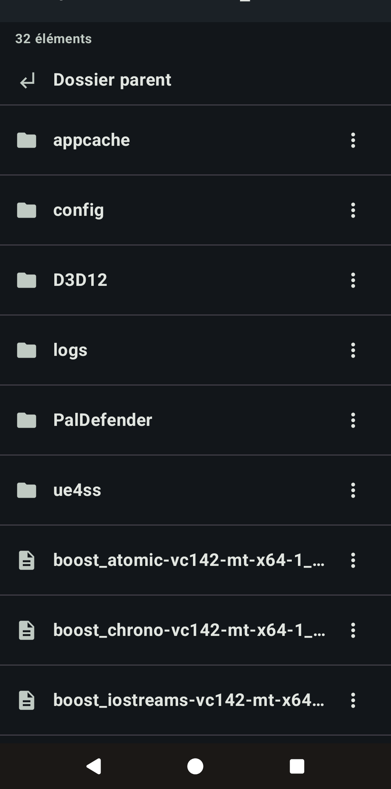
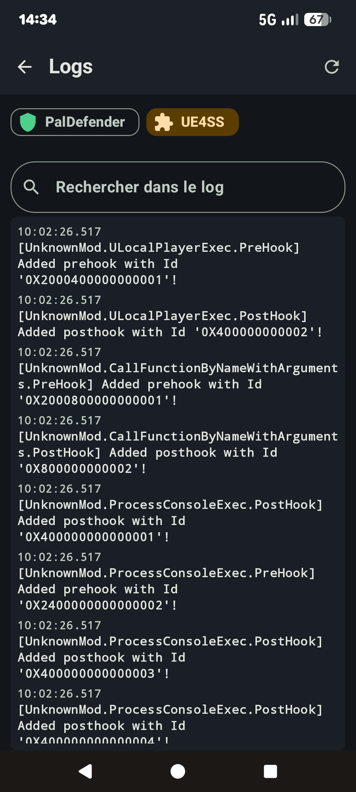

<p align="center"></p>

# PalManager

*[Lire en français](README.fr.md)*

Android admin app for dedicated **Palworld** servers, driven through the official Palworld
REST API and the **[PalDefender](https://github.com/UltimeIT/PalDefender)** mod's REST API.

> Unofficial fan project, not affiliated with Pocketpair. Game data (item/Pal names and images)
> comes from [paldb.cc](https://paldb.cc) and remains the property of its rightful owners — see
> [License](#license).

## Screenshots

<table>
<tr>
<td align="center"><b>Dashboard</b><br></td>
<td align="center"><b>Connected players</b><br></td>
<td align="center"><b>Give an item</b><br></td>
</tr>
<tr>
<td align="center"><b>Give a Pal</b><br></td>
<td align="center"><b>Player inventory</b><br></td>
<td align="center"><b>Broadcast & maintenance</b><br></td>
</tr>
<tr>
<td align="center"><b>Add a server</b><br></td>
<td align="center"><b>Pal Creator</b><br></td>
<td align="center"><b>SFTP file manager</b><br></td>
</tr>
<tr>
<td align="center"><b>Logs</b><br></td>
</tr>
</table>

## Features

- **Dashboard**: server info, online players, FPS, Palworld/PalDefender versions, save,
  restart/stop.
- **Connected players**: live list, kick/ban, private message, per-player inventory/team/
  progression/technologies detail views. Team Pals are tappable for a detail view (IV, Pal Soul,
  active skills, passives).
- **Guilds**: member list (searchable by guild or member name), all base locations pinned on the
  live map, per-camp Pal roster with detail view, chest, expeditions and lab research progress.
- **Give item / Give Pal**: search by name or image in a bundled catalog (items, Pals, NPCs,
  technologies), filters by category/element/rarity/job.
- **Live map**: player positions on the Palpagos Islands map.
- **Bans** (players + IP).
- **Broadcast & maintenance**: broadcast, alerts, messages, danger zone (reload config,
  delete base).
- **Debug logging**: optional network request/response log written to a folder you choose, to
  help diagnose connectivity issues.
- Light/dark theme, FR/EN interface (consistently applied to in-game data too).

### SFTP toolkit (optional)

Configure SSH/SFTP credentials on a server profile to unlock:

- **Logs**: PalDefender/UE4SS log viewer with search and colored severity.
- **SFTP**: browse/upload (single file or whole folder)/download/rename/copy/cut/paste/delete on
  the server's filesystem, with trust-on-first-use host key pinning.
- **Pal Creator**: build a PalDefender Pal Template file (species, gender, level, shiny/alpha,
  IVs, Pal Souls, active skills, passives) from a form and save it straight to the server's
  template folder — no manual JSON editing.
- **Verify**: a one-tap check on the Add/Edit server screen that the Palworld API, PalDefender
  API, and SFTP (if configured) are all reachable with the credentials you just typed in.

## Tech stack

Kotlin + Jetpack Compose (Material 3), MVVM, Hilt, Room, Retrofit/OkHttp + kotlinx.serialization,
Coil, Jetpack Navigation Compose, DataStore Preferences.

## Server requirements

- A Palworld server with the [official REST API](https://docs.palworldgame.com/) enabled
  (`RESTAPIEnabled=True` in `PalWorldSettings.ini`).
- The **[PalDefender](https://github.com/UltimeIT/PalDefender)** mod installed with its REST API
  enabled, for the features the official API doesn't cover (give item/Pal, techs, guilds,
  IP bans...).

## Build

```bash
./gradlew assembleDebug
```

The debug APK is generated in `app/build/outputs/apk/debug/`.

### Visual tests (Paparazzi)

The project bundles [Paparazzi](https://github.com/cashapp/paparazzi) to render Compose
composables on the JVM without an emulator (handy in dev to quickly check a screen):

```bash
./gradlew :app:recordPaparazziDebug
```

### Regenerating the item/Pal dataset

`tools/scrape_paldb.py` scrapes paldb.cc/fr to produce `app/src/main/assets/data/*.json` +
the associated images (bundled catalog, loaded once on first launch into a Room database with
FTS search).

## License

This repo's code is published under the [MIT](LICENSE) license.

The game data bundled in `app/src/main/assets/data/` and `app/src/main/assets/images/`
(names, stats, item/Pal/technology images) is extracted from paldb.cc and remains the property
of its respective rights holders (Pocketpair). It is not covered by the MIT license and is
included here for non-commercial use, to make the tool work.
